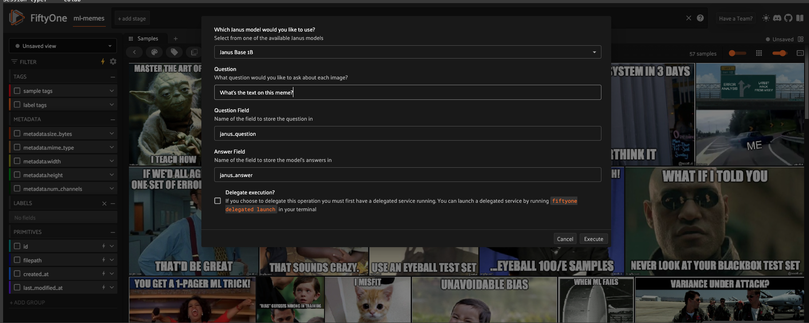

# 🐋 Janus Pro VQA Plugin





Janus-Pro is an advanced multimodal model designed for both **multimodal understanding** and visual generation, with a particular emphasis on improvements in understanding tasks. The model's architecture is built upon the concept of decoupled visual encoding, which allows it to handle the differing representation needs of these two types of tasks more effectively.


### Plugin Overview

The plugin provides a seamless interface to Janus Pro's visual question understanding capabilities within FiftyOne, offering:

* Vision-language tasks

* Hardware acceleration (CUDA/MPS) when available

* Dynamic version selection from HuggingFace

* Full integration with FiftyOne's Dataset and UI

🙏🏽 Issues and contributions are welcome!

## Installation

If you haven't already, install FiftyOne and required dependencies:

```bash
pip install -U fiftyone transformers torch git+https://github.com/deepseek-ai/Janus.git
```


Then, install the plugin:

```bash
fiftyone plugins download https://github.com/harpreetsahota204/janus-vqa-fiftyone
```

## Usage in FiftyOne App

You can use Janus directly through the FiftyOne App:

1. Launch the FiftyOne App with your dataset
2. Open the "Operators Browser" (click the icon or press `)
3. Search for "Run Janus"
4. Configure the parameters based on your chosen task

ℹ Note: This plugin assumes you are using a GPU with can support `bfloat16`.

### Available Tasks:

Janus-Pro excels in both **multimodal understanding** and **text-to-image generation**. It achieves this by decoupling the visual encoding for these two tasks, which mitigates the conflict between them.

**NOTE:** This plugin only supports the multimodal understanding tasks. Janus-Pro demonstrates superior performance in the following areas:

*   **General Image Understanding**: Janus-Pro exhibits impressive comprehension when handling inputs from various contexts. This suggests a broad understanding of image content and its relationship to textual descriptions.

*  **Object Recognition and Scene Description**: The model is capable of describing scenes in detail, identifying objects, and understanding their spatial relationships within an image. For example, it can describe a coastal landscape with rock formations, ocean waves, and a beach with cliffs.

*   **Landmark Recognition**: Janus-Pro can recognize famous landmarks. For instance, it can identify the West Lake in Hangzhou, China, specifically the Three Pools Mirroring the Moon island.

*   **Text Recognition**: Janus-Pro can perform text recognition within images, such as identifying the text "Serving Soul since Twenty Twelve" on a blackboard.

*   **Understanding of Complex Visual Content**: The model can understand and interpret images with complex scenes, such as the Tom and Jerry themed cake, where it can describe the characters, the cake decorations, and background story.

The model's ability to perform well on these varied benchmarks highlights its versatility in handling a range of multimodal understanding tasks. While Janus-Pro shows strong performance in multimodal understanding, it is noted that the input resolution is limited to 384 × 384, which can affect its performance in fine-grained tasks such as OCR.

Whatever the task you are looking for, just pass it in to the `question` parameter in the operator or the UI.

## Operator Usage via SDK

Once installed, you can use the operator programmatically:

```python
import fiftyone.operators as foo

janus_vqa = foo.get_operator("@harpreetsahota/janus_vqa/janus_vqa")
```

# For vision language tasks

```python
janus_vqa(
    dataset,
    model_path="deepseek-ai/Janus-Pro-1B",
    question="Write a funny song about this image",
    question_field="song_q",
    answer_field="song_a",
    delegate=True
)
```


If using delegated operation in an notebook, first run: `fiftyone delegated launch` and then use `await` with any of the operations.

```python
await janus_vqa(
    dataset,
    model_path="deepseek-ai/Janus-Pro-1B",
    question="Write a funny song about this image",
    question_field="song_task",
    answer_field="song_answer",
    delegate=True
)
```

# Citation

Model weights are pulled from the [Janus Hugging Face](https://huggingface.co/deepseek-ai/Janus-Pro-7B) model card.

You can visit the original GitHub or the [Janus repository](https://github.com/deepseek-ai/Janus) for additional information.

```bibtex
@misc{chen2025januspro,
      title={Janus-Pro: Unified Multimodal Understanding and Generation with Data and Model Scaling}, 
      author={Xiaokang Chen and Zhiyu Wu and Xingchao Liu and Zizheng Pan and Wen Liu and Zhenda Xie and Xingkai Yu and Chong Ruan},
      year={2025},
}

@article{wu2024janus,
  title={Janus: Decoupling visual encoding for unified multimodal understanding and generation},
  author={Wu, Chengyue and Chen, Xiaokang and Wu, Zhiyu and Ma, Yiyang and Liu, Xingchao and Pan, Zizheng and Liu, Wen and Xie, Zhenda and Yu, Xingkai and Ruan, Chong and others},
  journal={arXiv preprint arXiv:2410.13848},
  year={2024}
}

@misc{ma2024janusflow,
      title={JanusFlow: Harmonizing Autoregression and Rectified Flow for Unified Multimodal Understanding and Generation}, 
      author={Yiyang Ma and Xingchao Liu and Xiaokang Chen and Wen Liu and Chengyue Wu and Zhiyu Wu and Zizheng Pan and Zhenda Xie and Haowei Zhang and Xingkai yu and Liang Zhao and Yisong Wang and Jiaying Liu and Chong Ruan},
      journal={arXiv preprint arXiv:2411.07975},
      year={2024}
}
```